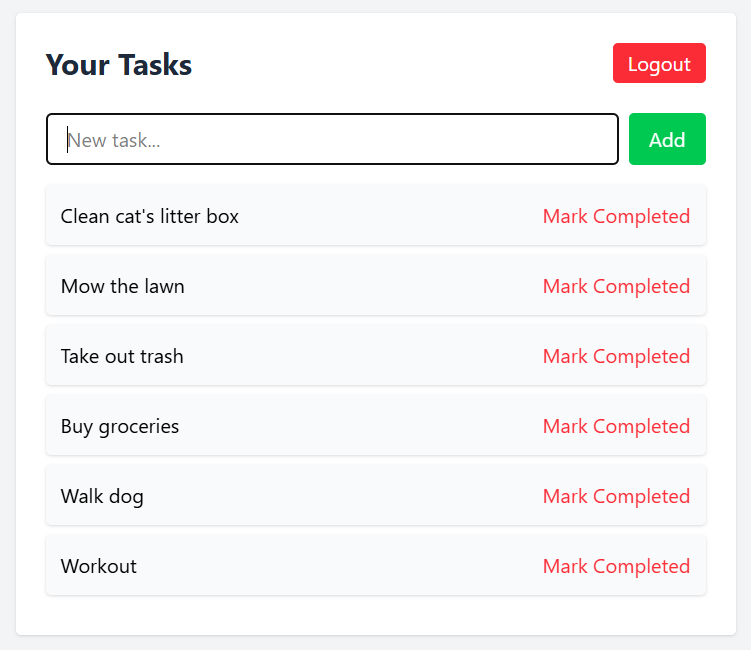

# Taskflo

## Description
Taskflo is a simple and elegant task manager built for people who want to stay organized without feeling overwhelmed. It’s designed to help users — especially those who tend to forget daily tasks — stay focused and get things done in a calm, intuitive way. Through this project, I learned how to build and connect a full-stack application using modern technologies like React, Node.js, and MongoDB, while prioritizing user experience and clean UI design.

## Table of Contents
- [Installation](#installation)
- [Usage](#usage)
- [Credits](#credits)
- [License](#license)
- [How to Contribute](#how-to-contribute)
- [Tests](#tests)

## Installation
This project does not require an installation. However, you are welcome to to either clone the repository and access the project files or fork the repo.

## Usage
Deployed on [...](...)

Once running locally, users can sign up, log in, and begin managing tasks via the dashboard. Tasks can be added, deleted, and reordered with a simple drag-and-drop interface.

## Credits
Andres Albornoz

## License
This project has an MIT license.

## How to Contribute
If you'd like to collaborate on future enhancements or projects, feel free to reach out via GitHub!

## Tests
Tested locally using manual task creation, login/logout, and drag-and-drop functionality across various devices and screen sizes.
